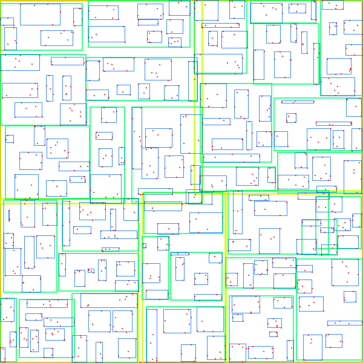
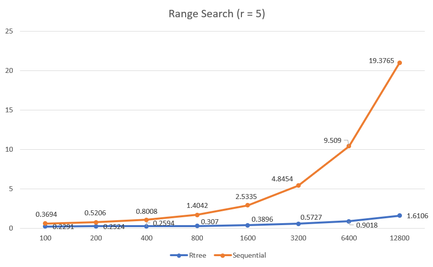
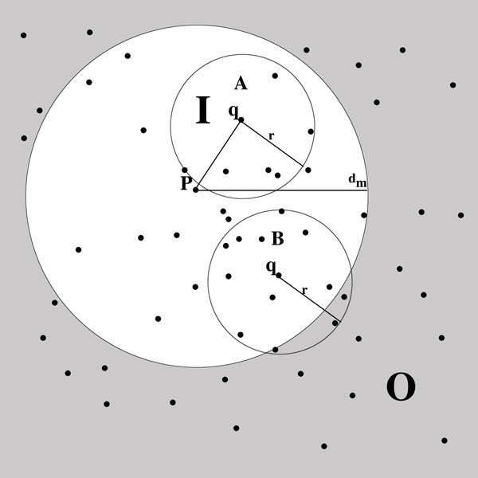
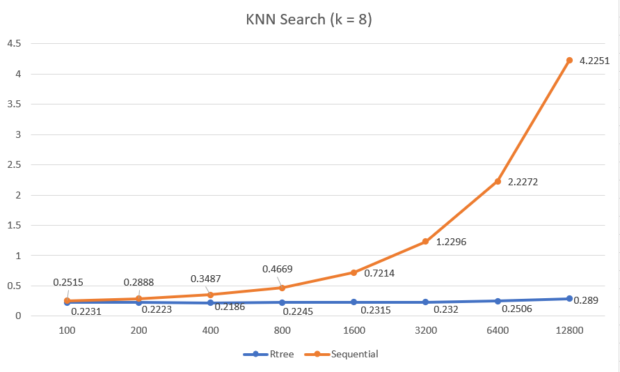

# Proyecto 3 de Base de Datos

## Integrantes

| Nombre y Apellidos | Código de alumno |
|-|-|
|Victor Ostolaza | 201910049 |
|Jorge Vásquez	| 201310292 |
|Jorge Rebosio | 201820025|

## RTree

## Pruebas Funcionales KNN Search

| Test  | Size  |KNN - Rtree | KNN- Secuencial| 
| :------------ |:---------------:| -----:| ------:|
| 1 | 100 |  0.2263 seconds|  0.2835 seconds |
| 2 | 200 |  0.2289 seconds | 0.2862 seconds|
| 3 | 400 |  0.2274 seconds| 0.3635 seconds  |
| 4 | 800 |  0.2264 seconds |  0.4812 seconds |
| 5 | 1600 | 0.2292 seconds  |  0.7350 seconds|
| 6 | 3200 | 0.2320 seconds| 1.2296 seconds |
| 7 | 6400 | 0.2505 seconds | 2.2272 seconds |
| 8 | 12800 | 0.2890 seconds | 4.2251 seconds|

## Pruebas Funcionales Range Search

| Test  | Size  |Range - Rtree | Range - Secuencial| 
| :------------ |:---------------:| -----:| ------:|
| 1 | 100 |   0.2413 seconds|   0.3886 seconds |
| 2 | 200 | 0.2428 seconds  |	0.5486 seconds |
| 3 | 400 | 0.2677 seconds |   0.8184 seconds |
| 4 | 800 | 0.3065 seconds | 1.4662 seconds   |
| 5 | 1600 | 0.3912 seconds | 2.6174 seconds |
| 6 | 3200 | 0.5727 seconds | 4.8454 seconds|
| 7 | 6400 | 0.9018 seconds |9.5090 seconds |
| 8 | 12800 | 1.6106 seconds|19.3765 seconds |

